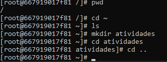

# Relatório

- 2.2.2. Navegação básica

- 2.2.3. Manipulação de arquivos

- 2.2.4. Gerenciamento de pacotes

1.

2.

3 & 4.

 
- 2.2.5. Permissões de arquivos

- 2.2.6. Processos em execução

- 2.2.7. Encerrando o contêiner

